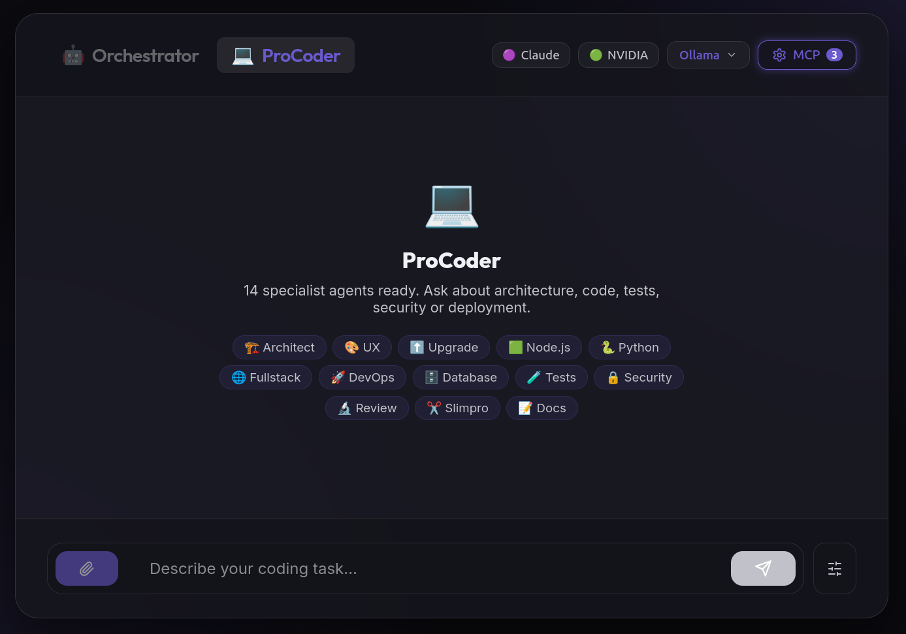

# Orchestrator — Multi-Agent AI System

A multi-agent orchestration platform with two specialist agent teams: **Marketing** (9 agents for SEO, ads, and growth research) and **ProCoder** (12 agents for local software development). Supports **5 backends** — Ollama, LM Studio, Anthropic Claude, NVIDIA NIM, and OpenRouter — with live model testing for function calling, tool calling, MCP, vision, and audio capabilities.

> **Use weaker local models in a strict agentic environment.** The orchestrator compensates for limited model capability through structured routing, multi-agent delegation, and MCP tool augmentation. A small 7B model with the right tools often outperforms a large model flying blind.



---

## Available Models

Models are discovered automatically from your configured backends. Set API keys in `.env` to unlock cloud providers.

### Local Models (no API key required)

| Backend | How it works | Models shown |
|---|---|---|
| **Ollama** | `ollama serve` + `ollama pull <model>` | All pulled models with context length |
| **LM Studio** | Local Server tab → Start Server | All loaded models in LM Studio |

### Cloud Models (API key required)

| Backend | Env variable | Models available |
|---|---|---|
| **Anthropic Claude** | `ANTHROPIC_API_KEY` | claude-sonnet-4, claude-opus, claude-sonnet-3.7, claude-haiku |
| **NVIDIA NIM** | `NVIDIA_API_KEY` | llama-3.1-70b, mistral-large, nemotron, codegemma |
| **OpenRouter** | `OPENROUTER_API_KEY` | 200+ models — gpt-4o, claude-3.5-sonnet, gemini-2.0, deepseek, qwen, llama, mistral, and more |

---

## Model Tester

Test any model before using it. Click the **🧪 Test** button in the header to run a capability suite:

| Test | What it checks |
|---|---|
| **Response Speed** | Latency for a trivial prompt (< 20s = OK) |
| **JSON Output** | Can the model return parseable JSON? |
| **Function Calling** | Single tool call with correct arguments |
| **Tool Calling (multi)** | Parallel calls to multiple tools |
| **MCP Tool Calling** | Uses real MCP servers (filesystem, shell, etc.) |
| **Vision** | Supports image input (detected via API or model name) |
| **Audio** | Supports audio input (Whisper, GPT-4o-audio, Gemini, Claude) |
| **Instruction Discipline** | Follows precise JSON structure instructions |

Results stream live with a weighted score (0–100) and verdict.

---

## Agent Teams

Switch between teams in the UI. Each team has its own orchestrator and specialist agents.

### Marketing Team — 9 agents

| Agent | Emoji | Speciality |
|---|---|---|
| `findkey` | 🔍 | Broad SEO keyword research — primary, secondary, long-tail, LSI, intent |
| `findbuykey` | 🛒 | Buy-intent & transactional keywords — price, deal, review terms |
| `findadwords` | 📢 | Google Ads intelligence — CPC estimates, ad copy, competitor ads |
| `findbacklinks` | 🔗 | Backlink opportunities — forums, guest posts, directories, partnerships |
| `findcompetitors` | 🎯 | Competitor tier analysis — market leaders, mid-market, emerging players |
| `findcritics` | 🔬 | QA / quality control — reviews other agents, gives PASS / REVISE / REDO |
| `findfunnels` | 🌊 | Sales funnel reverse-engineering — CTAs, hooks, upsells, retention |
| `findideas` | 💡 | Creative ideas & 90-day roadmaps — channels, campaigns, strategies |
| `findregions` | 🌍 | Regional market intelligence — demand signals, buyer behaviour by region |

### ProCoder Team — 12 agents

A local coding assistant squad. Describe what you want to build — the orchestrator delegates to the right specialist.

| Agent | Emoji | Speciality |
|---|---|---|
| `architect` | 🏗️ | System design, tech stacks, API contracts, data flows, ADRs |
| `nodepro` | 🟩 | Node.js / TypeScript — APIs, Express, Fastify, NestJS, async patterns |
| `pythonpro` | 🐍 | Python — FastAPI, Django, Flask, data pipelines, scripting |
| `fullstackpro` | 🌐 | React, Next.js, Vue, HTML/CSS, UI components, accessibility |
| `dbpro` | 🗄️ | Schema design, SQL/NoSQL, migrations, indexing, query optimisation |
| `devopspro` | 🚀 | Docker, CI/CD, Kubernetes, cloud platforms, IaC, monitoring |
| `testpro` | 🧪 | Unit, integration & e2e tests — strategy, coverage, mocking, TDD |
| `secpro` | 🔒 | OWASP Top 10, auth/authz, secrets management, secure code review |
| `reviewpro` | 🔬 | Code quality — smells, performance, maintainability; PASS/REVISE/REDO |
| `docpro` | 📝 | README, API docs, inline comments, changelogs, ADRs |
| `uxpro` | 🎨 | UI/UX — wireframes, design systems, user flows, component specs |
| `upgradepro` | ⬆️ | Audits UIs and code for UX issues, performance bottlenecks, improvements |

```
You: "build a REST API with auth and postgres"
          ↓
  Orchestrator analyses intent
          ↓
  🏗️ architect → defines structure and contracts
  🟩 nodepro   → writes the API code
  🗄️ dbpro     → designs the schema
  🔒 secpro    → reviews auth implementation
```

---

## Architecture

```
┌──────────────────────────────────────┐
│          Web UI  (React)             │  ← Vite dev server :5173
│  chat · model picker · team switcher │
│  MCP toggles · system prompt editor  │
│  🧪 Model Tester                     │
└──────────────┬───────────────────────┘
               │ SSE stream
┌──────────────▼───────────────────────┐
│       Backend API  (Express)         │  ← port 3001
│  /api/chat  /api/models  /api/model-test │
│  /mcp  /api/vision-check             │
└──────────────┬───────────────────────┘
               │
      ┌────────▼──────────┐
      │    Orchestrator   │  routes to specialist agents
      │  Marketing / Pro  │
      └────────┬──────────┘
               │
   ┌───────────▼──────────────────────────┐
   │  Ollama / LM Studio  (local)         │  ← your own hardware
   │  Claude / NVIDIA NIM (cloud)         │  ← API key required
   │  OpenRouter          (cloud)         │  ← API key required
   └───────────┬──────────────────────────┘
               │  (optional)
   ┌───────────▼──────────────────────────┐
   │  MCP Servers                         │
   │  memory · filesystem · github        │
   │  desktop-commander                   │
   └──────────────────────────────────────┘
```

---

## Setup

### Prerequisites

- [Ollama](https://ollama.com) or [LM Studio](https://lmstudio.ai) for local models
- Node.js 18+
- **Cloud models (optional):** API keys for Anthropic, NVIDIA, and/or OpenRouter

---

### 1 — Start your local model

**Ollama:**
```bash
ollama serve
ollama pull qwen2.5:14b
```

**LM Studio:**
Load a model → Local Server tab → Start Server (default port 1234)

---

### 2 — Configure environment

```bash
cp .env.example .env
```

```env
LM_STUDIO_URL=http://192.168.x.x:1234/v1
OLLAMA_URL=http://localhost:11434/v1
DEFAULT_BACKEND=ollama          # ollama | lmstudio | claude | nvidia | openrouter
DEFAULT_MODEL=                  # leave blank = auto-detect
TEMPERATURE=0.7
MAX_TOKENS=32752
STREAM=true

# Cloud (optional)
ANTHROPIC_API_KEY=sk-ant-...
NVIDIA_API_KEY=nvapi-...
OPENROUTER_API_KEY=sk-or-...
```

For ProCoder, place your coding system prompt in `use.txt` at the repo root. The backend loads it automatically at startup.

---

### 3 — Start the web UI

```bash
cd gui
./start.sh
```

Opens at [http://localhost:5173](http://localhost:5173). Use the team switcher in the UI to toggle between **Marketing** and **ProCoder**.

Or start manually:

```bash
# Backend
cd gui/backend && npm install && node server.js

# Frontend (new terminal)
cd gui/frontend && npm install && npm run dev
```

---

## MCP Tool Integration

Enable/disable MCP servers live from the UI without restarting:

| Server | What it gives agents |
|---|---|
| `memory` | Persistent cross-session memory |
| `filesystem` | Read/write access to local files |
| `github` | Repo browsing, issue/PR access |
| `desktop-commander` | Shell commands, process control |

Configure servers in `mcp-config.json`.

---

## Tech Stack

| Layer | Tech |
|---|---|
| Frontend | React 18, Vite, lucide-react |
| Backend | Express 5, Node.js ESM |
| LLM runtime | Ollama · LM Studio (local) · Claude · NVIDIA NIM · OpenRouter (cloud) |
| Tool protocol | Model Context Protocol (MCP) |
| Streaming | Server-Sent Events (SSE) |

---

## Project Structure

```
orchestrator/
├── .env                     Environment variables (not committed)
├── use.txt                  ProCoder system prompt (loaded at runtime)
├── mcp-config.json          MCP server configuration
│
└── gui/
    ├── start.sh
    ├── backend/
    │   ├── server.js        Express API — handles both agent teams
    │   ├── agents.js        Marketing agent definitions
    │   ├── agents-code.js   ProCoder agent definitions
    │   ├── vision-utils.js  Vision/audio capability detection
    │   └── mcp-manager.js   MCP server lifecycle
    └── frontend/
        └── src/
            ├── App.jsx            Main chat interface + team switcher
            ├── ModelSelector.jsx  Backend & model picker
            ├── ModelTester.jsx    🧪 Live model capability tester
            └── McpSettings.jsx    MCP toggle UI
```

---

## License

MIT
